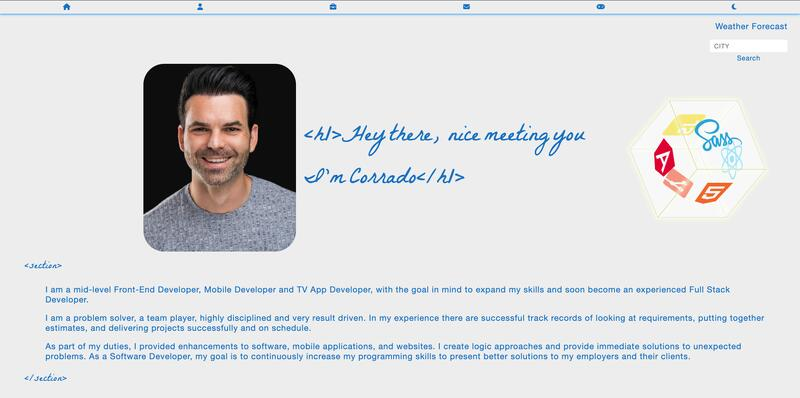

# Personal Portfolio Website

This is my website to resume my work as a Software Developer. The application was built using React.js, typescript and SASS.

**[Live Demo](https://corry104.github.io/portfolio/)**



## Technologies Used

- React.js
- Typescript
- Sass

## Installation Guide

You can the application locally by cloning the repository on your local machine.


* Clone the repository
  ```
  git clone https://github.com/Corry104/portfolio.git
  ```
* Install the packages
  ```
  npm install
  ```
* Start the project
  ```
  npm start
  ```


### `npm start`

Runs the site in the development mode.\
Open [http://localhost:3000](http://localhost:3000) to view it in the browser.

The page will reload if you make edits.\
You will also see any lint errors in the console.

